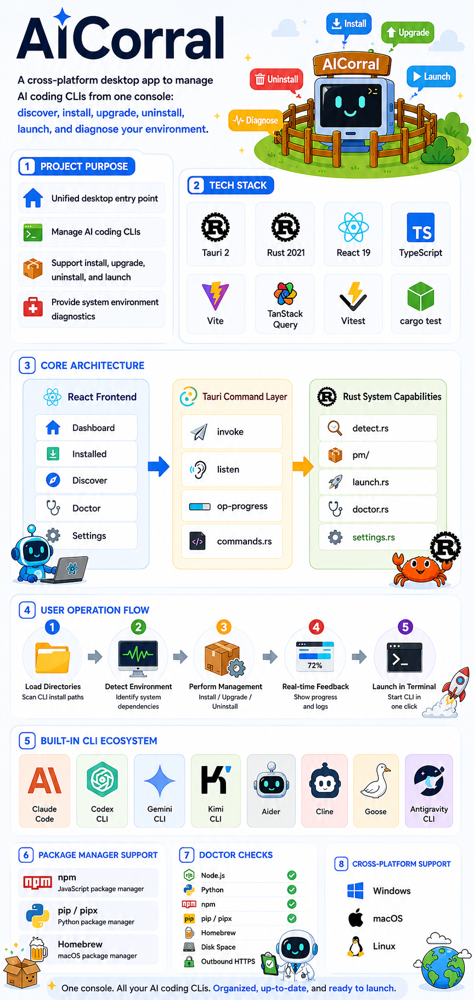

# AICorral

A cross-platform desktop app for managing AI coding CLIs — install, upgrade, uninstall, and launch tools like Claude Code, Codex, Gemini CLI, Aider, and more from one place.

Built with [Tauri 2](https://tauri.app) + Rust + React + TypeScript.

> [中文版 README](./README_cn.md)

---



---

## Features

| Feature | Details |
|---|---|
| **Catalog** | 8 curated AI coding CLIs bundled in the app, filterable by tag |
| **Detection** | Scans `PATH` for installed CLIs, reads `--version` output and binary mtime |
| **Install / Upgrade / Uninstall** | Delegates to npm, pip/pipx, or Homebrew — live log stream in the UI |
| **Launch** | Opens the CLI in your system terminal (Windows Terminal / cmd, macOS Terminal, Linux x-terminal-emulator) |
| **Doctor** | Checks Node, Python, package managers, disk, and outbound HTTPS reachability |
| **Settings** | Persist custom npm registry, pip index URL, and HTTP proxy |
| **Detail Drawer** | Click any row to open a side panel with version info, binary path, and actions |

---

## Supported CLIs

| CLI | Vendor | Manager | Platforms |
|---|---|---|---|
| [Claude Code](https://github.com/anthropics/claude-code) | Anthropic | npm | Windows · macOS · Linux |
| [Codex CLI](https://github.com/openai/codex) | OpenAI | npm | Windows · macOS · Linux |
| [Gemini CLI](https://github.com/google-gemini/gemini-cli) | Google | npm | Windows · macOS · Linux |
| [Kimi CLI](https://github.com/MoonshotAI/kimi-cli) | Moonshot AI | npm | Windows · macOS · Linux |
| [Aider](https://aider.chat) | Paul Gauthier | pip | Windows · macOS · Linux |
| [Cline](https://github.com/cline/cline) | Cline | npm | Windows · macOS · Linux |
| [Goose](https://github.com/block/goose) | Block | Homebrew | macOS · Linux |
| [Antigravity CLI](https://antigravity.dev) | Antigravity Labs | npm | Windows · macOS · Linux |

---

## Installation

Download the latest release for your platform from the [Releases](https://github.com/iniak/AICorral/releases) page:

- **Windows** — `AICorral_x.x.x_x64_en-US.msi` or `AICorral_x.x.x_x64-setup.exe`
- **macOS** — `AICorral_x.x.x_x64.dmg` *(build on macOS)*
- **Linux** — `AICorral_x.x.x_amd64.AppImage` or `.deb` *(build on Linux)*

> **Prerequisites:** Node.js ≥ 18 and/or Python ≥ 3.10 must already be on your PATH for the respective CLIs to be installable.

---

## Development

### Prerequisites

- [Rust](https://rustup.rs) (stable toolchain)
- [Node.js](https://nodejs.org) ≥ 18
- [Tauri prerequisites](https://tauri.app/start/prerequisites/) for your OS (WebView2 on Windows, Xcode CLT on macOS)

### Setup

```bash
git clone https://github.com/iniak/AICorral.git
cd AICorral
npm install
```

### Dev server

```bash
npm run tauri dev
```

Opens the app with hot-reload. The Rust backend recompiles on save.

### Tests

```bash
# Frontend (Vitest + Testing Library)
npx vitest run

# Rust unit tests
cd src-tauri && cargo test
```

### Production build

```bash
npm run tauri build
```

Artifacts land in `src-tauri/target/release/bundle/`.

---

## Architecture

```
AICorral/
├── catalog.json              # Bundled CLI catalog (embedded into binary via include_str!)
├── src/                      # React + TypeScript frontend
│   ├── App.tsx               # Root: routing, drawer state, QueryClient
│   ├── api/tauri.ts          # Typed invoke() + listen() wrappers
│   ├── hooks/                # TanStack Query hooks (useCatalog, useInstalled, useLatest…)
│   ├── screens/              # Dashboard, Installed, Discover, Doctor, Settings
│   └── components/           # Sidebar, ListRow, DetailDrawer, Monogram, Toast…
└── src-tauri/src/            # Rust backend
    ├── catalog.rs            # Parse catalog.json at compile time
    ├── detect.rs             # PATH lookup + --version parsing with regex
    ├── pm/                   # PackageManager trait → npm / pip / brew
    ├── commands.rs           # All Tauri commands + op-progress event streaming
    ├── launch.rs             # OS-native terminal launch
    ├── doctor.rs             # Environment health checks
    └── settings.rs           # JSON settings persistence (dirs::config_dir)
```

**Data flow:** React calls `invoke('command_name')` → Tauri command in `commands.rs` → Rust logic (detect / pm / launch) → result back to React via TanStack Query. Long-running operations (install/upgrade/uninstall) emit `op-progress` events that the frontend listens to with `listen()`.

---

## Tech Stack

| Layer | Technology |
|---|---|
| Desktop runtime | Tauri 2 |
| Backend | Rust 2021 — tokio, which, reqwest, regex, serde, dirs, anyhow |
| Frontend | React 19, TypeScript, Vite |
| State / async | TanStack Query v5 |
| Fonts | Geist + Geist Mono (bundled, variable .woff2) |
| Tests | Vitest + Testing Library (frontend) · cargo test (Rust) |

---

## Development Assistance

This project was developed with assistance from Claude Code and ChatGPT Codex.

---

## License

MIT
