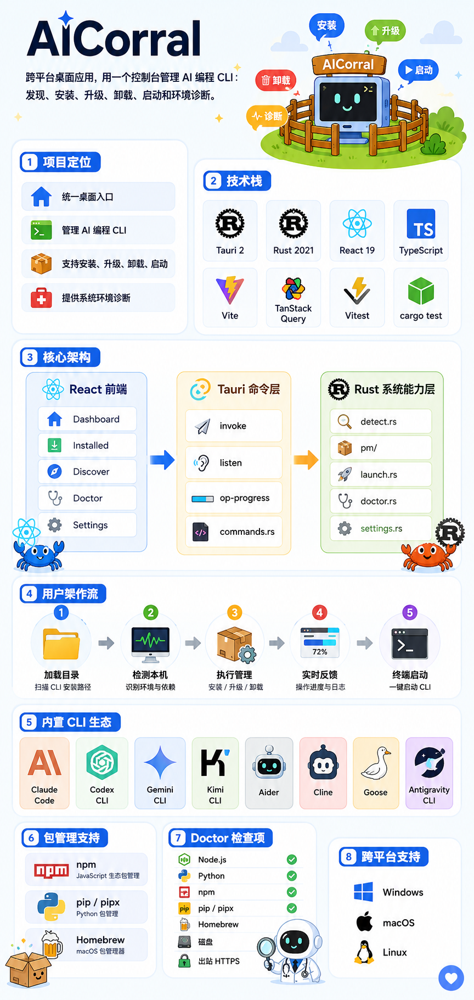

# AICorral

一个跨平台桌面应用，用于统一管理本机安装的 AI 编程 CLI 工具——支持安装、升级、卸载和一键启动 Claude Code、Codex、Gemini CLI、Aider 等主流工具。

基于 [Tauri 2](https://tauri.app) + Rust + React + TypeScript 构建。

> [English README](./README.md)

---



---

## 功能特性

| 功能 | 说明 |
|---|---|
| **内置目录** | 预置 8 款精选 AI 编程 CLI，支持按标签筛选 |
| **自动检测** | 扫描系统 `PATH`，解析 `--version` 输出及二进制文件修改时间 |
| **安装 / 升级 / 卸载** | 委托 npm、pip/pipx 或 Homebrew 执行，UI 实时展示日志流 |
| **一键启动** | 在系统终端中启动 CLI（Windows Terminal / cmd · macOS Terminal · Linux x-terminal-emulator） |
| **环境诊断** | 检测 Node.js、Python、包管理器、磁盘空间及出站 HTTPS 连通性 |
| **设置持久化** | 自定义 npm 镜像源、pip 索引地址和 HTTP 代理 |
| **详情侧边栏** | 点击任意 CLI 行，弹出含版本信息、二进制路径和操作按钮的侧边抽屉 |

---

## 支持的 CLI 工具

| CLI | 开发商 | 包管理器 | 支持平台 |
|---|---|---|---|
| [Claude Code](https://github.com/anthropics/claude-code) | Anthropic | npm | Windows · macOS · Linux |
| [Codex CLI](https://github.com/openai/codex) | OpenAI | npm | Windows · macOS · Linux |
| [Gemini CLI](https://github.com/google-gemini/gemini-cli) | Google | npm | Windows · macOS · Linux |
| [Kimi CLI](https://github.com/MoonshotAI/kimi-cli) | Moonshot AI | npm | Windows · macOS · Linux |
| [Aider](https://aider.chat) | Paul Gauthier | pip | Windows · macOS · Linux |
| [Cline](https://github.com/cline/cline) | Cline | npm | Windows · macOS · Linux |
| [Goose](https://github.com/block/goose) | Block | Homebrew | macOS · Linux |
| [Antigravity CLI](https://antigravity.dev) | Antigravity Labs | npm | Windows · macOS · Linux |

---

## 安装

从 [Releases](https://github.com/iniak/AICorral/releases) 页面下载对应平台的安装包：

- **Windows** — `AICorral_x.x.x_x64_en-US.msi` 或 `AICorral_x.x.x_x64-setup.exe`
- **macOS** — `AICorral_x.x.x_x64.dmg`（需在 macOS 上构建）
- **Linux** — `AICorral_x.x.x_amd64.AppImage` 或 `.deb`（需在 Linux 上构建）

> **前置条件：** 各 CLI 所需的运行时（Node.js ≥ 18 / Python ≥ 3.10）须已安装并在系统 `PATH` 中。

---

## 本地开发

### 环境准备

- [Rust](https://rustup.rs)（stable 工具链）
- [Node.js](https://nodejs.org) ≥ 18
- [Tauri 系统依赖](https://tauri.app/start/prerequisites/)（Windows 需 WebView2，macOS 需 Xcode Command Line Tools）

### 安装依赖

```bash
git clone https://github.com/iniak/AICorral.git
cd AICorral
npm install
```

### 启动开发模式

```bash
npm run tauri dev
```

支持前端热重载，Rust 后端修改后自动重新编译。

### 运行测试

```bash
# 前端（Vitest + Testing Library）
npx vitest run

# Rust 单元测试
cd src-tauri && cargo test
```

### 生产构建

```bash
npm run tauri build
```

安装包输出至 `src-tauri/target/release/bundle/`。

---

## 架构概览

```
AICorral/
├── catalog.json              # 内置 CLI 目录（编译时通过 include_str! 嵌入二进制）
├── src/                      # React + TypeScript 前端
│   ├── App.tsx               # 根组件：路由、侧边栏状态、QueryClient
│   ├── api/tauri.ts          # 类型化的 invoke() + listen() 封装
│   ├── hooks/                # TanStack Query hooks（useCatalog、useInstalled、useLatest…）
│   ├── screens/              # Dashboard、Installed、Discover、Doctor、Settings
│   └── components/           # Sidebar、ListRow、DetailDrawer、Monogram、Toast…
└── src-tauri/src/            # Rust 后端
    ├── catalog.rs            # 编译期解析 catalog.json
    ├── detect.rs             # PATH 查找 + 正则解析 --version 输出
    ├── pm/                   # PackageManager trait → npm / pip / brew 实现
    ├── commands.rs           # 所有 Tauri 命令 + op-progress 事件流
    ├── launch.rs             # 系统原生终端启动
    ├── doctor.rs             # 环境健康检查
    └── settings.rs           # JSON 设置持久化（dirs::config_dir）
```

**数据流：** React 调用 `invoke('命令名')` → `commands.rs` 中的 Tauri 命令 → Rust 逻辑（检测 / 包管理 / 启动）→ 结果经 TanStack Query 返回前端。安装/升级/卸载等长耗时操作通过 `op-progress` 事件实时推送日志行，前端用 `listen()` 订阅。

---

## 技术栈

| 层次 | 技术 |
|---|---|
| 桌面运行时 | Tauri 2 |
| 后端 | Rust 2021 — tokio、which、reqwest、regex、serde、dirs、anyhow |
| 前端 | React 19、TypeScript、Vite |
| 状态管理 | TanStack Query v5 |
| 字体 | Geist + Geist Mono（本地打包，可变字重 .woff2） |
| 测试 | Vitest + Testing Library（前端）· cargo test（Rust） |

---

## 开源协议

MIT
